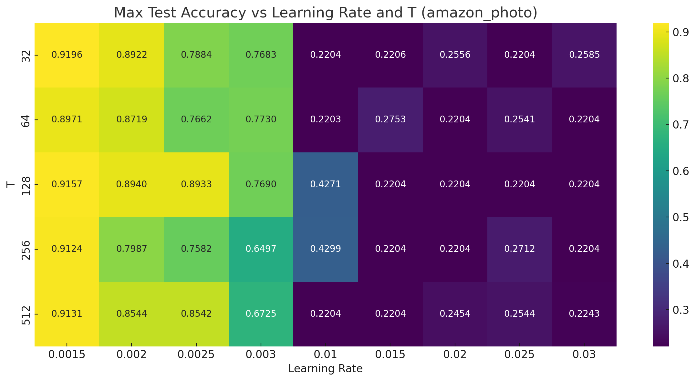
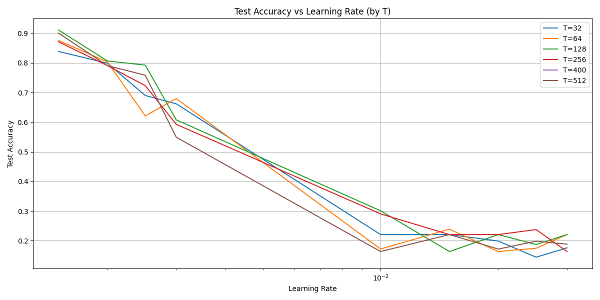
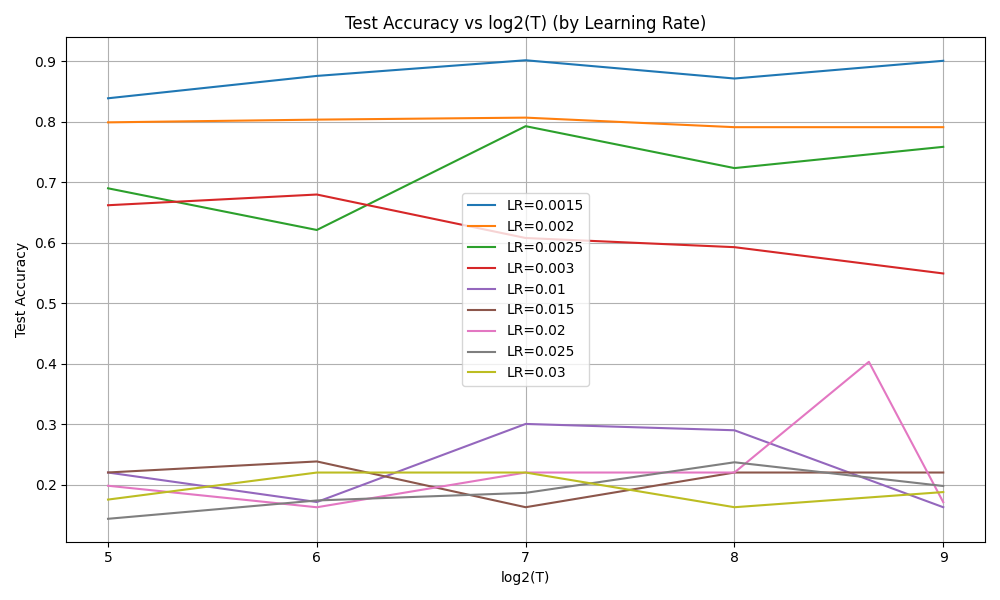
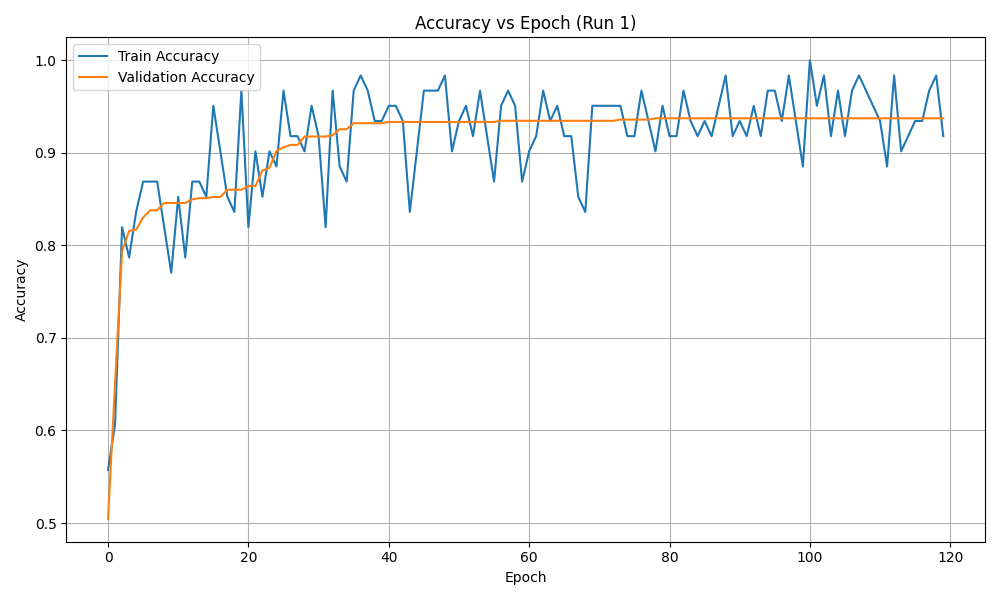
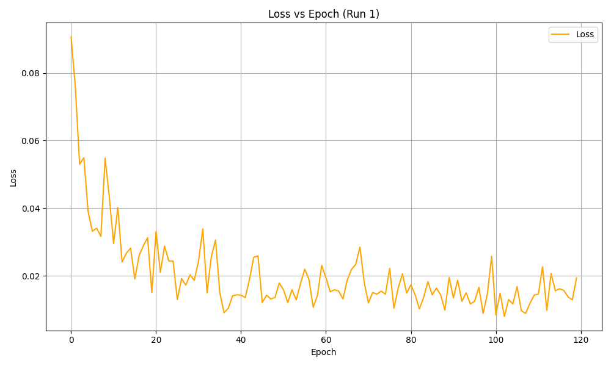

# DRSGNN 复现报告

- **论文标题**：Dynamic Reactive Spiking Graph Neural Network
- **作者与出处**：Zhao et al., 2024
- **代码仓库地址**：https://github.com/hzhao98/DRSGNN

## 2. 实验环境

- **系统**：Ubuntu 20.04
- **Python 版本**：3.8.10
- **关键依赖包**：
  ```python
  graphgallery @ git+https://github.com/EdisonLeeeee/GraphGallery.git@98cc8013ffc9a5da9e5af1f6eb34760847ef7c1f
  matplotlib==3.2.0
  networkx==3.1
  numpy==1.24.4
  pandas==1.1.0
  scikit-learn==0.24.0
  scipy==1.9.3
  spikingjelly==0.0.0.0.12
  termcolor==2.4.0
  torch==2.4.1
  torchaudio==2.4.1
  torchvision==0.19.1
  tqdm==4.67.1
  ```
- **GPU 支持**：使用 `cuda:1`
- **运行方式**：`tmux` 保持后台运行

## 3. 数据准备

- **数据集**：amazon_photo, amazon_cs, coauthor_phy
- **文件路径**：`dataset/datafromgg/amazon_photo.npz`等
- **位置编码文件**：`PE/amazon_photo/RWPE.npy`等

## 4. 代码结构与修改点

- 主要执行文件：`run_snn.py`
- 主模型文件：`model_lif_fc_with_val.py`, `model_lif_fc.py`
- 修改内容：
  - 添加日志记录 `training.log`
  - 通过 `if_with_val` 参数控制是否使用验证集
  - 改正了 `run_snn.py` 中 `main函数` 里 do_search_params 部分的条件分支逻辑
  - 根据超参搜索结果修改 `models_conf.json` 的参数配置

## 5. 超参数搜索

- **执行入口**：`search_params()`
- **搜索范围**：
  - `T`: 32, 64, 128, 256, 512
  - `learning_rate`: 0.0015, 0.002, 0.0025,0.003,0.01, 0.015, 0.02, 0.025, 0.03
- **搜索日志**：`tmpdir/snn/snn_search.log`
- **可视化图表**：
  - 热力图：`max_test_accuracy` vs `T`, `learning_rate`
  - 单变量趋势图：分别分析 `T` 和 `learning_rate` 对性能的影响
- **最优参数**：
  - `T = 128`
  - `learning_rate = 0.0015`
  - `max_test_accuracy ≈ 0.9157`

  
### 可视化
* 热力图：`max_test_accuracy` vs `T`, `learning_rate`


* 不同T下，准确率随learning_rate变化的曲线图


* 不同learning_rate下，准确率随T变化的曲线图


## 6. 最终训练设置

- **模式**：固定参数训练
- **配置文件**：`models_conf.json`
- **运行方式**：

  ```
  tmux new -s final_run
  python run_snn.py
  ```

- **runs**：3 次
- **输出路径**：
  - 日志：`training.log`
  - 模型：`tmpdir/snn/amazon_photo/best_snn.model`

## 7. 结果记录

### 不同数据集上的表现
| Dataset        | Acc(avg) | Std     |
|----------------|----------|---------|
| Amazon Photo   | 91.9%    | 0.01247 |
| Amazon CS      | 87.0%    | 0.006   |
| Coauthor Phy   | 95.47%   | 0.00095 |

以Amazon Photo数据集为例：
* Accuracy随epoch的变化


* Loss随epoch的变化



## 8. 总结

- 成功复现 DRSGNN 在 amazon_photo, amazon_cs, coauthor_phy 上的表现，结果稳定，性能与原论文所述相符。
- 建议使用 `T=128`、`lr=0.0015` 作为默认配置